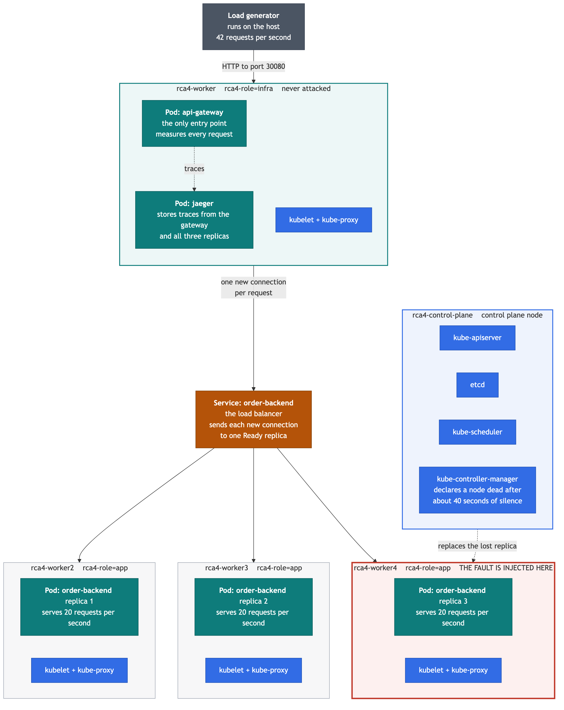

# Scenario 4: Kubernetes Fault Tolerance, Rerouting and Restabilization

Scenarios 1-3 broke an application. This one breaks the **infrastructure
underneath it**, and then measures how long the orchestrator takes to heal.

We run a real Kubernetes cluster with an order backend replicated across three
nodes behind a load balancer, drive continuous traffic through it, and then
violently kill one of the nodes mid-flight. Kubernetes reroutes traffic to the
survivors, notices the node is gone, and schedules a replacement. Every
millisecond of that is recorded by OpenTelemetry.

The AI question is different from the earlier scenarios too. Instead of
classifying "is this a crash?", we train a **regressor** on the recovery curve
to answer: *given the first few seconds of a latency spike, how long until the
system is fully stable again?*

---

## 1. What actually happens during a run

A run is five minutes of steady traffic with a node killed 60 seconds in. The
telemetry goes through four distinct phases:

| Phase | Roughly | What it looks like | Why |
| --- | --- | --- | --- |
| **baseline** | T-60 → T+0 | p50 ~110 ms, no errors, 3 replicas serving | Healthy. |
| **blackhole** | T+0 → T+45 | ~1 in 3 requests fails after a 5 s hang; p50 stays normal | The node is dead but Kubernetes doesn't know yet. The Service still lists the dead pod as an endpoint, so a third of traffic is routed into a hole. |
| **brownout** | T+45 → T+75 | No errors, but p50 climbs 110 ms → ~1900 ms | The endpoint has been removed. Two replicas now absorb all the traffic with two thirds of the capacity, so a queue builds. |
| **recovering → stable** | T+75 → T+88 | Third replica appears, latency decays back to baseline | The replacement pod is scheduled, warms up, becomes Ready, and the backlog drains. |

In the measured run in this repo, full restabilization took **88 seconds**, and
p95 peaked at **24× baseline**.

The blackhole phase is the part people find surprising, and it is the most
valuable thing this scenario teaches: **Kubernetes does not detect a dead node
instantly.** The node controller waits out a grace period (~40 s by default)
before marking the node's pods unhealthy. Until then, the load balancer keeps
confidently routing traffic to a machine that no longer exists.

---

## 2. The cluster



**Figure 1.** The cluster. The layout follows the component structure of the
official Kubernetes architecture diagram, so the control plane holds
`kube-apiserver`, `etcd`, `kube-scheduler` and `kube-controller-manager`, and
every worker node holds `kubelet` and `kube-proxy` alongside its Pods.

Read the figure top to bottom. That is the path a single request takes:

1. The **load generator** runs on the host and sends 42 requests every second.
2. Those requests enter the cluster at the **api-gateway** Pod, which is the only
   entry point and which measures and records every request.
3. The gateway forwards each request to the **order-backend Service**. This is
   the load balancer: it sends every new connection to one replica that is
   currently marked Ready.
4. The Service spreads the work across the **three order-backend replicas**, one
   on each app node.

Two things happen outside that path. The gateway and all three replicas send
their measurements to the **jaeger** Pod, which stores them. And the
**kube-controller-manager** watches the nodes; when one stops answering, it is
the component that declares the node dead and replaces the replica that was
lost.

Colours carry meaning in the figure:

| Colour | Meaning |
| --- | --- |
| Blue | Kubernetes' own components. We did not write these. |
| Teal | The software we wrote, running as Pods. |
| Amber | The load balancer. |
| Grey | Runs on the host machine, outside the cluster. |
| Red border | The node we destroy. Everything else survives. |

Host access: gateway on `localhost:30080`, Jaeger UI on `localhost:30686`.

The figure is generated from [docs/cluster-architecture.mmd](docs/cluster-architecture.mmd).
To regenerate it after an edit:

```bash
npx -y @mermaid-js/mermaid-cli@11 -i docs/cluster-architecture.mmd \
    -o docs/cluster-architecture.png -b white -s 3
```

A few design choices are load-bearing, and each one is commented in the file it
lives in:

- **The backend has bounded concurrency** (`WORKER_SLOTS` requests at a time,
  each taking `SERVICE_TIME_MS`). Without a capacity limit, losing a replica
  would only reduce throughput, never increase latency, and there would be no
  brownout to observe.
- **Jaeger and the gateway live on their own node**, not on the control plane.
  They must survive the fault, and they must not compete for CPU with the
  components that get busy *because* of the fault.
- **`Connection: close` on every upstream call.** Kubernetes balances per
  connection, so a pooled keep-alive connection would pin to one pod and we'd
  never see traffic reroute.
- **Preferred, not required, pod anti-affinity.** Replicas spread one-per-node
  while healthy, but the replacement is allowed to double up on a survivor -
  otherwise it would sit `Pending` forever and the system could never recover.
- **10-second unreachable toleration.** The Kubernetes default is 300 s, which
  would stall the replacement for five minutes.

---

## 3. Choosing the load: the arithmetic that makes or breaks this

Each replica serves `WORKER_SLOTS / SERVICE_TIME_MS` = **20 req/s**. So three
replicas serve 60 req/s and two serve 40 req/s.

Losing one of three replicas multiplies utilisation by exactly **1.5×**, and
queue wait grows like `ρ/(1-ρ)`. That makes the offered load the single most
important knob in the whole scenario:

| Offered load | Healthy ρ | Wounded ρ | Result |
| --- | --- | --- | --- |
| 36 req/s | 0.60 | 0.90 | Stable even while wounded. Spike is only ~3×: real, but underwhelming. |
| **42 req/s** | **0.70** | **1.05** | **The default.** Survivors are just over capacity, so the backlog grows while the replacement is missing, then drains. This is what produces a curve with a shape. |
| 48 req/s | 0.80 | 1.20 | Queue runs away, latency pins at the gateway timeout. Dramatic, but saturated - no shape left for the model to learn. |

---

## 4. Prerequisites

| Requirement | macOS | Windows | Linux |
| --- | --- | --- | --- |
| Container runtime | Docker Desktop or OrbStack, **running** | Docker Desktop with the **WSL 2** backend, **running** | Docker Engine |
| `kind` | `brew install kind` | `winget install Kubernetes.kind` | `go install` or the release binary |
| `kubectl` | `brew install kubectl` | `winget install Kubernetes.kubectl` | `snap install kubectl --classic` |
| Python | 3.10 or newer | 3.10 or newer, from python.org, **Add python.exe to PATH** ticked | 3.10 or newer |
| A bash shell | built in | **Git Bash**, installed with Git for Windows, or WSL 2 | built in |

**Windows users, read this before starting.** Three of the helper scripts here
are shell scripts (`cluster_up.sh`, `reset_cluster.sh`, `cluster_down.sh`), and
they need a bash shell. You almost certainly already have one: Git for Windows
installs **Git Bash**, and Docker Desktop requires **WSL 2**. Either will run
them unchanged. Open Git Bash in this folder and follow the commands exactly as
written. Everything else in the scenario is Python and runs the same everywhere.

The cluster is five containers plus two Python processes, so it wants roughly
4 GB of memory free. If your machine is tight on RAM, lower `--rps` rather than
adding nodes. On Windows, give WSL 2 at least 4 GB in `%UserProfile%\.wslconfig`
if the cluster fails to become Ready.

---

## 5. Running it

### 5.1 Create the Python environment

Run these from inside `RCA-SCenario4`.

| Step | macOS, Linux, Git Bash | Windows PowerShell |
| --- | --- | --- |
| Create | `python3 -m venv scene4` | `py -3 -m venv scene4` |
| Activate | `source scene4/bin/activate` | `.\scene4\Scripts\Activate.ps1` |

```
python -m pip install --upgrade pip
python -m pip install -r requirements.txt
```

With the environment active, `python` means this environment's Python on every
operating system, which is why the commands below say `python` and not
`./scene4/bin/python`.

### 5.2 Build the cluster and run the experiment

```bash
# Step 1+2: build the cluster, deploy everything, confirm a healthy baseline.
# On Windows, run this line from Git Bash.
bash scripts/cluster_up.sh

# Step 3+4: traffic for 5 minutes, node killed at T+60, keep hammering while it heals
python scripts/load_generator.py --duration 300 --rps 42 --chaos-at 60
```

### 5.3 Turn the run into a dataset and a prediction

Set `RUN` to the run folder the load generator printed. Never type the angle
brackets from an example: both bash and PowerShell read `<` and `>` as
redirection, which is what produces `parse error near '\n'`.

```bash
# macOS, Linux, Git Bash
RUN=runs/run_20260728_141846_node
python scripts/extract_data.py  --run-dir "$RUN"
python scripts/build_dataset.py --run-dir "$RUN"
python scripts/forecast_recovery.py
```

```powershell
# Windows PowerShell
$RUN = "runs\run_20260728_141846_node"
python scripts\extract_data.py  --run-dir $RUN
python scripts\build_dataset.py --run-dir $RUN
python scripts\forecast_recovery.py
```

To let the shell pick the most recent run instead of typing its name:

```bash
# macOS, Linux, Git Bash
RUN=$(ls -dt runs/*/ | head -1)
```

```powershell
# Windows PowerShell
$RUN = (Get-ChildItem runs -Directory | Sort-Object LastWriteTime -Descending)[0].FullName
```

`cluster_up.sh` prints the run command with the right flags, and each script
prints the next one. `RUNBOOK.md` has the command reference and troubleshooting.

The load generator prints a live one-line-per-second view, so you can watch the
brownout happen:

```text
   time     rps   ok  err   p50ms   p95ms   maxms  replicas serving
   20:30:15   42   42    0    113.9   172.4   201.3  3
   20:30:16   42   37    5    113.2   172.1  5009.7  3   <== FAULT INJECTED
   20:30:19   42   27   15    157.4  5015.2  5021.1  2   <== errors
   ...
   20:31:04   42   42    0    943.1  1091.4  1123.8  2   <== degraded
   20:31:31   42   42    0    163.2  1756.0  1801.2  3
```

---

## 6. Steps 5 and 6: from traces to a prediction

### The dataset is per-second, not per-trace

Scenarios 1-3 produced one row per trace labelled healthy/crash. A recovery time
cannot be labelled that way. Here every **second** of the incident is one row:

- **Features** — what an SRE would see on a dashboard: request rate, error rate,
  p50/p95/max latency, mean queue wait, how many distinct replicas actually
  served traffic, the 5-second latency slope, and time since the fault.
- **Label** — `seconds_to_restabilize`, i.e. how much longer the healing has
  left to run.

### Restabilization is defined, not eyeballed

A run counts as restabilized at the first second from which, for 8 of the next
10 seconds: p95 is back within 25 % of the pre-fault baseline, the error rate is
back to its baseline floor, and all three replicas are serving again.

Two deliberate details there. It compares against the **measured baseline**
rather than zero, and it requires 8 of 10 seconds rather than all 10. Both exist
because this environment has a small background error rate — kube-proxy
occasionally loses a SYN under a high rate of short-lived connections, and TCP
retransmission turns that request into a slow one. Roughly 1-4 % of seconds
contain one such request even when nothing is wrong. Demanding perfection would
make the finish line hostage to one unlucky packet.

### What the model learns, and an honest caveat

`forecast_recovery.py` trains RandomForest, GradientBoosting and a linear
baseline, then prints the live forecast an on-call engineer would see:

```text
[T+ 10s]  p95=5010ms  replicas_serving=2  errors=16
          Node failure detected. Orchestrator rerouting traffic.
          Estimated time to full system restabilization: 78 seconds.
```

**One run is not a training set.** With a single incident, the model discovers
that `seconds_to_restabilize = 88 - time_since_fault` and simply reads the
clock — feature importance for `time_since_fault` comes out at 0.998 and the
apparent error is ±0 s. That is memorization, not forecasting, and the script
says so out loud rather than quietly reporting a flattering number.

To guard against exactly this, every model is scored on two feature sets:

| Feature set | What it tests | MAE on the single run in this repo |
| --- | --- | --- |
| full | includes `time_since_fault` | 1.81 s (meaningless — it is reading a clock) |
| signal-only | latency and replica-count shape only, no clock | **15.78 s** |

The signal-only number is the one worth believing, and it is the one that
improves as you add runs. **Collect at least three runs before quoting any
accuracy figure:**

```bash
bash scripts/reset_cluster.sh    # restart the dead node, re-spread the replicas
./scene4/bin/python scripts/load_generator.py --duration 300 --rps 42 --chaos-at 60
# ... extract, build, repeat
```

Each run appends to `data/recovery_dataset.csv`. Once there are two or more,
`forecast_recovery.py` automatically switches to **leave-one-run-out**
validation: train on all runs but one, predict the recovery it has never seen.
That is the number that means something.

Varying the runs makes the model better and the evaluation harder: use
`--chaos-mode pod` for a much faster recovery with no detection phase, and vary
`--rps` to change the brownout depth.

---

### Autoregression: is it still getting worse, or settling?

The recovery-time model answers "how much longer?". A second, simpler question
matters just as much while an incident is running: is the response time still
climbing, or has it turned the corner? Because the telemetry is a time series,
the natural model is autoregression, which predicts the next second from the last
few seconds. `evaluate_scenario_models.py` reports it alongside the other models,
leave-one-incident-out, on the 95th percentile latency curve:

| Model | MAE | RMSE | R² |
| --- | --- | --- | --- |
| AR(5) | 491 ms | **1,042 ms** | **0.749** |
| Linear Regression on elapsed time | 1,766 ms | 2,129 ms | -0.047 |
| Last value carried forward | **371 ms** | 1,116 ms | 0.713 |

Two honest readings. First, the straight-line model is useless here, with an R²
below zero, meaning it is worse than simply predicting the average. A node
failure is a step change, not a trend. Second, the naive "assume nothing changes"
baseline has the lowest average error, because for most seconds nothing does
change. Autoregression wins on RMSE and R², which is the more informative
comparison: those measure the large errors, and the large errors happen exactly
at the moments that matter, when latency is moving fast. The naive baseline is
always one step behind a change; the AR model is not.

---

## 7. Every Run Is Saved Automatically

Terminal output scrolls away and is hard to compare between runs, so every script
here writes what it printed into a `results/` folder as well as to the screen:

```text
results/run_003_20260821_143012_evaluate_model.txt   full console transcript
results/run_003_20260821_143012_evaluate_model.csv   one row per score
results/run_003_20260821_143012_evaluate_model.pdf   the transcript, paginated
```

The run number counts the reports already present, so runs stay in order and
nothing is ever overwritten. Use the **CSV** when comparing several runs, because
every score is one row with its run number, timestamp, section, model, metric and
value. Use the **PDF** when attaching a run to an email, a report appendix or a
supervision meeting.

This behaviour needs no flags and no extra commands. It is provided by
`run_report.py`, which uses only the standard library, plus matplotlib for the
PDF. If matplotlib is missing, the text and CSV reports are still written.

---

## 8. Files

```text
RCA-SCenario4/
├── app/
│   ├── order_backend.py       # replicated service, bounded concurrency + warm-up
│   ├── api_gateway.py         # instrumented entry point, records which pod served
│   └── Dockerfile             # one image, both roles
├── k8s/
│   ├── kind-cluster.yaml      # 5 nodes: control-plane, infra, 3x app
│   ├── 00-namespace.yaml
│   ├── 10-jaeger.yaml         # Jaeger in-cluster, NodePort 30686
│   ├── 20-order-backend.yaml  # 3 replicas, anti-affinity, fast-failover tolerations
│   └── 30-api-gateway.yaml    # gateway + NodePort 30080
├── scripts/
│   ├── cluster_up.sh          # build cluster + image, deploy, smoke test
│   ├── cluster_down.sh        # delete the cluster
│   ├── reset_cluster.sh       # restore baseline between runs
│   ├── load_generator.py      # open-loop traffic + timed chaos injection
│   ├── inject_chaos.py        # kill a node (default) or a pod
│   ├── extract_data.py        # Jaeger API -> raw_trace_data.json
│   ├── build_dataset.py       # traces -> labelled per-second time series
│   └── forecast_recovery.py   # train, evaluate, chart, live forecast
├── runs/<run_id>/             # per-run: metrics, chaos event, traces, time series
├── data/recovery_dataset.csv  # all runs pooled - the training set
├── recovery_forecast.png      # generated chart
├── RUNBOOK.md                 # commands and troubleshooting
└── requirements.txt
```

---

## 9. Differences from Scenarios 1-3

| | Scenarios 1-3 | Scenario 4 |
| --- | --- | --- |
| Failure origin | Application (memory leak, queue, network) | Infrastructure (a node dies) |
| Environment | One script, or two Docker containers | A 5-node Kubernetes cluster |
| Jaeger | Standalone container on the host | Deployed inside the cluster |
| Host ports | 16686 / 4317 | 30686 / 30080 (no collision with the others) |
| ML task | Classification: healthy vs crash | Regression: seconds until restabilized |
| Row granularity | One row per trace | One row per second of the incident |
| Label source | Injected error flag | Derived from the recovery curve itself |

Because Jaeger runs inside the cluster on different host ports, this scenario
can run at the same time as the standalone Jaeger the earlier scenarios use.
